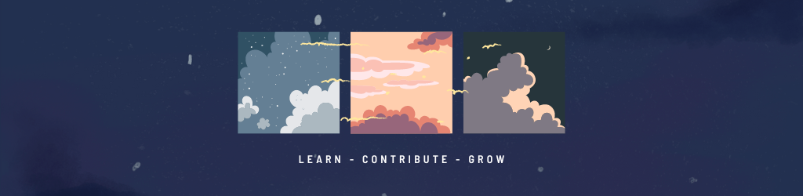

## <h1 align="center"> Hi there 👋</h1>

I'm Abul Khasim, a passionate computer science student with a flair for web development. I'm an enthusiastic developer with expertise in both front-end and back-end technologies. I have been dedicated to building impactful, user-focused applications that address real-world challenges and deliver seamless experiences. 
<!-- cysec -->

- 🌱 I’m currently learning NextJS.
- 👯 I’m looking to contribute on open source projects.
- 💬 Ask me anything about Web Development.
- 📫 How to reach me: abulkhasim486@gmail.com

## 📈 Stats ~ 

   

  

 

> Note: The number of contributions is subject to college exams. 😂

## <h1>Languages and Tools<h1>

  

## Recent Hackathons

Submitted to | Project Name | Result |
|:---:|:---:|:---:|
PESTIM Shimogga | In-Transit Vehicle Booking Web App | Winner |
Christ University Bangalore | XposedOrNot | Winner | 
Jyothiy Institute of Technology Bangalore | Predict Stock Using Ai | Best Innovation |
<!-- 

&nbsp;

 -->